Arquitectura de Computadoras - 2023 - Trabajo Práctico Final

# Diseño e Implementación de un Procesador MIPS Segmentado en una FPGA
Autores: 
- Bottini, Franco Nicolas 
    - <francobottini99@mi.unc.edu.ar>
- Robledo, Valentin 
    - <valentin.robledo@mi.unc.edu.ar>

## Tabla de Contenidos

- [¿ Cómo usar este repositorio ?](#¿-cómo-usar-este-repositorio-)
    - [1. Clonar el repositorio](#1-clonar-el-repositorio)
    - [2. Crear un nuevo proyecto en Vivado](#2-crear-un-nuevo-proyecto-en-vivado)
    - [3. Agregar los archivos del proyecto](#3-agregar-los-archivos-del-proyecto)
    - [4. Generar el bitstream](#4-generar-el-bitstream)
    - [5. Programar la FPGA](#5-programar-la-fpga)
    - [6. Ejectuar la aplicación de usuario](#6-ejectuar-la-aplicación-de-usuario)
- [¿ Cómo usar la aplicación de usuario ?](#¿-cómo-usar-la-aplicación-de-usuario-)
- [Resumen](#resumen)
- [Especificaciones del Procesador](#especificaciones-del-procesador)
- [Desarrollo](#desarrollo)
    - [Arquitectura del procesador](#procesador-mips-segmentado)
    - [Etapas del Pipeline](#etapas-del-pipeline)
        - [1. Etapa IF](#1-etapa-if)
        - [2. Etapa ID](#2-etapa-id)
        - [3. Etapa EX](#3-etapa-ex)
        - [4. Etapa MEM](#4-etapa-mem)
        - [5. Etapa WB](#5-etapa-wb)
    - [Control y Detención de Riesgos](#control-y-detención-de-riesgos)
        - [Unidad de Control Principal](#unidad-de-control-principal)
            - [Tabla de Control Principal](#tabla-de-control-principal)
        - [Unidad de Control Alu](#unidad-de-control-alu)
            - [Tabla de Control Alu](#tabla-de-control-alu)
        - [Unidad de Cortocircuito](#unidad-de-cortocircuito)
            - [Tabla de Control Cortocircuito](#tabla-de-control-cortocircuito)
        - [Unidad de Detención de Riesgos](#unidad-de-detención-de-riesgos)
            - [Tabla de Control Detención de Riesgos](#tabla-de-control-detención-de-riesgos)
    - [Operación del Procesador](#operación-del-procesador)
        - [UART](#uart)
        - [Debugger](#debugger)
    - [Clock Wizard](#clock-wizard)
- [Simulaciones](#simulaciones)
- [Resultados](#resultados)
        
## ¿ Cómo usar este repositorio ?

### 1. Clonar el repositorio
El repositorio se puede clonar utilizando el comando `git clone`:

```bash
git clone https://github.com/FrancoNB/ARQ_ICOMP_2023-TP_FINAL
```

### 2. Crear un nuevo proyecto en Vivado
Para crear un nuevo proyecto en Vivado, se debe abrir el software y seleccionar la opción `Create Project` en la ventana de inicio. Luego, se debe ingresar un nombre para el proyecto y seleccionar la ubicación donde se guardará. Posteriormente, se debe seleccionar la opción `RTL Project` y la opción `Do not specify sources at this time`. Finalmente, se debe seleccionar la placa de desarrollo `Basys 3` y la opción `Verilog` como lenguaje de descripción de hardware. Con esto debería crearse un nuevo proyecto vacío.

> [!WARNING]
> Se resalta la necesidad de seleccionar la opcion `Do not specify sources at this time`.

### 3. Agregar los archivos del proyecto
Para agregar los archivos del proyecto, se debe hacer click derecho sobre la carpeta `Sources` del proyecto y seleccionar la opción `Add Sources`. Luego, se debe seleccionar la opción `Add or create design sources` y la opción `Add Directiries`. Finalmente, se deben seleccionar el directorio `vivado.src/sources` del repositorio clonado. Repetir proceso para el directorio `vivado.src/constrs` y el directorio `vivado.src/sim`.

### 4. Generar el bitstream
Generar el bitstream del proyecto utilizando la opción `Generate Bitstream` del menú `Flow Navigator`.

### 5. Programar la FPGA
Conectar la placa de desarrollo a la computadora y programar la FPGA utilizando la opción `Program Device` del menú `Flow Navigator`.

### 6. Ejectuar la aplicación de usuario
Para operar el procesador, se utiliza la aplicación `python.src/app.py`. Para ejecutar la aplicación, se debe abrir una terminal en el directorio `python.src` y ejecutar el comando `py app.py`.

## ¿ Cómo usar la aplicación de usuario ?


## Resumen
Este trabajo se desarrolló en el marco de la materia Arquitectura de Computadoras de la carrera Ingeniería en Computación de la Facultad de Ciencias Exactas, Físicas y Naturales de la Universidad Nacional de Córdoba. Consiste en la implementación de una versión simplificada de un procesador **MIPS** segmentado en una placa de desarrollo **FPGA**.

Un procesador [MIPS (*Microprocessor without Interlocked Pipeline Stages*)](https://es.wikipedia.org/wiki/MIPS_(procesador)) es un tipo de microprocesador de 32 bits que utiliza una arquitectura de conjunto de instrucciones reducidas (RISC). Esta arquitectura se caracteriza por su simplicidad, ya que utiliza un número reducido de instrucciones de tamaño fijo que se ejecutan en un solo ciclo de reloj.

El diseño segmentado, también conocido como diseño de tubería o ["*pipeline*"](https://es.wikipedia.org/wiki/Segmentaci%C3%B3n_(electr%C3%B3nica)), es una técnica que permite la ejecución simultánea de varias instrucciones en diferentes etapas de procesamiento. Esto aumenta la eficiencia y el rendimiento del procesador.

En este proyecto, se implementará el procesador **MIPS** en una [FPGA (Field Programmable Gate Array)](), un dispositivo semiconductor que se puede programar para realizar una amplia variedad de tareas de procesamiento digital. La versión simplificada del procesador **MIPS** se diseñó para facilitar su comprensión y su implementación en la **FPGA**.

> [!NOTE]
> El proyecto se desarrolló en el lenguaje de descripción de hardware [Verilog](https://es.wikipedia.org/wiki/Verilog) utilizando el software [Vivado](https://www.xilinx.com/products/design-tools/vivado.html) de la empresa [Xilinx](https://www.xilinx.com/). El procesador **MIPS** se implementó en la placa de desarrollo **FPGA** [Basys 3](https://digilent.com/reference/programmable-logic/basys-3/start) de la empresa [Digilent](https://digilent.com/).


## Especificaciones del Procesador
El procesador **MIPS** implementa un *pipeline* de 5 etapas, cada una de las cuales se ejecuta en un ciclo de reloj. Las etapas son las siguientes:

1. **IF (Instruction Fetch)**: Se lee la instrucción de la memoria de instrucciones.
2. **ID (Instruction Decode)**: Se decodifica la instrucción y se leen los registros.
3. **EX (Execute)**: Se ejecuta la instrucción.
4. **MEM (Memory Access)**: Se accede a la memoria de datos.
5. **WB (Write Back)**: Se escriben los resultados en los registros.

El pipeline de ejecución soporta el siguiente subconjunto de instrucciones del procesador **MIPS IV**:

| Instrucción | Descripción | Formato | resultado | Tipo | 
| ----------- | ----------- | ----------- | ----------- | ----------- |
| `sll` | Shift left logical | `sll $rd, $rt, shamt` | `$rd = $rt << shamt` | R |
| `srl` | Shift right logical | `srl $rd, $rt, shamt` | `$rd = $rt >> shamt` | R |
| `sra` | Shift right arithmetic | `sra $rd, $rt, shamt` | `$rd = $rt >> shamt` | R |
| `sllv` | Shift left logical variable | `sllv $rd, $rt, $rs` | `$rd = $rt << $rs` | R |
| `srlv` | Shift right logical variable | `srlv $rd, $rt, $rs` | `$rd = $rt >> $rs` | R |
| `srav` | Shift right arithmetic variable | `srav $rd, $rt, $rs` | `$rd = $rt >> $rs` | R |
| `add` | Suma | `add $rd, $rs, $rt` | `$rd = $rs + $rt` | R |
| `addu` | Suma sin signo | `addu $rd, $rs, $rt` | `$rd = $rs + $rt` | R |
| `sub` | Resta | `sub $rd, $rs, $rt` | `$rd = $rs - $rt` | R |
| `subu` | Resta sin signo | `subu $rd, $rs, $rt` | `$rd = $rs - $rt` | R |
| `and` | AND lógico | `and $rd, $rs, $rt` | `$rd = $rs & $rt` | R |
| `or` | OR lógico | `or $rd, $rs, $rt` | `$rd = $rs \| $rt` | R |
| `xor` | XOR lógico | `xor $rd, $rs, $rt` | `$rd = $rs ^ $rt` | R |
| `nor` | NOR lógico | `nor $rd, $rs, $rt` | `$rd = ~($rs \| $rt)` | R |
| `slt` | Set on less than | `slt $rd, $rs, $rt` | `$rd = ($rs < $rt) ? 1 : 0` | R |
| `lb` | Load byte | `lb $rt, imm($rs)` | `$rt = MEM[$rs + imm]` | I |
| `lh` | Load halfword | `lh $rt, imm($rs)` | `$rt = MEM[$rs + imm]` | I |
| `lw` | Load word | `lw $rt, imm($rs)` | `$rt = MEM[$rs + imm]` | I |
| `lwu` | Load word unsigned | `lwu $rt, imm($rs)` | `$rt = MEM[$rs + imm]` | I |
| `lbu` | Load byte unsigned | `lbu $rt, imm($rs)` | `$rt = MEM[$rs + imm]` | I |
| `lhu` | Load halfword unsigned | `lhu $rt, imm($rs)` | `$rt = MEM[$rs + imm]` | I |
| `sb` | Store byte | `sb $rt, imm($rs)` | `MEM[$rs + imm] = $rt` | I |
| `sh` | Store halfword | `sh $rt, imm($rs)` | `MEM[$rs + imm] = $rt` | I |
| `sw` | Store word | `sw $rt, imm($rs)` | `MEM[$rs + imm] = $rt` | I |
| `addi` | Suma inmediata | `addi $rt, $rs, imm` | `$rt = $rs + imm` | I |
| `andi` | AND lógico inmediato | `andi $rt, $rs, imm` | `$rt = $rs & imm` | I |
| `ori` | OR lógico inmediato | `ori $rt, $rs, imm` | `$rt = $rs \| imm` | I |
| `xori` | XOR lógico inmediato | `xori $rt, $rs, imm` | `$rt = $rs ^ imm` | I |
| `lui` | Load upper immediate | `lui $rt, imm` | `$rt = imm << 16` | I |
| `slti` | Set on less than inmediato | `slti $rt, $rs, imm` | `$rt = ($rs < imm) ? 1 : 0` | I |
| `beq` | Branch on equal | `beq $rs, $rt, imm` | `if ($rs == $rt) PC = PC + 4 + imm << 2` | I |
| `bne` | Branch on not equal | `bne $rs, $rt, imm` | `if ($rs != $rt) PC = PC + 4 + imm << 2` | I |
| `j` | Jump | `j target` | `PC = target << 2` | I |
| `jal` | Jump and link | `jal target` | `$ra = PC + 4; PC = target << 2` | I |
| `jr` | Jump register | `jr $rs` | `PC = $rs` | J |
| `jalr` | Jump and link register | `jalr $rs` | `$ra = PC + 4; PC = $rs` | J |

Además, el procesador implementado detecta y elimina los riesgos estructurales, de datos y de control. Estos son:

- **Riesgos estructurales**: Se producen cuando dos instrucciones intentan acceder al mismo recurso al mismo tiempo.

- **Riesgos de datos**: Se producen cuando una instrucción depende del resultado de otra instrucción que aún no se ha completado.

- **Riesgos de control**: Se producen cuando una instrucción de salto condicional cambia el flujo de ejecución del programa.

Para subsanar estos riesgos, se implementaron las siguientes técnicas:

- **Forwarding**: Se utiliza para resolver los riesgos de datos. Consiste en enviar el resultado de una instrucción a una etapa anterior del *pipeline* para que pueda ser utilizado por otra instrucción.

- **Stalling**: Se utiliza para resolver los riesgos de datos y de control. Consiste en detener el avance del *pipeline* hasta que se resuelva el riesgo.

## Desarrollo

### Arquitectura del Procesador
La arquitectura del procesador **MIPS** segmentado se muestra en la siguiente figura:

<p align="center">
  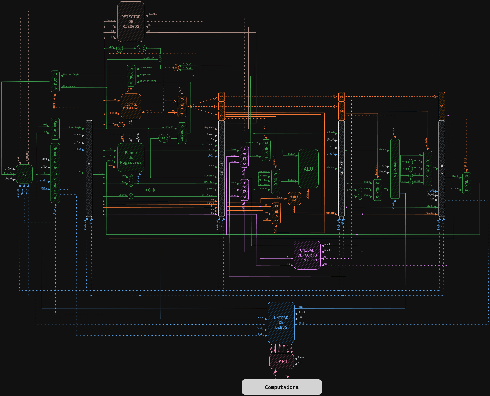
</p>

### Etapas del Pipeline
El *pipeline* se implementa a través de los modulos `if_id`, `id_ex`, `ex_mem` y `mem_wb` que se encargan de interconectar las distintas etapas de procesamiento. Estas etapas son:

#### 1. Etapa IF

<p align="center">
  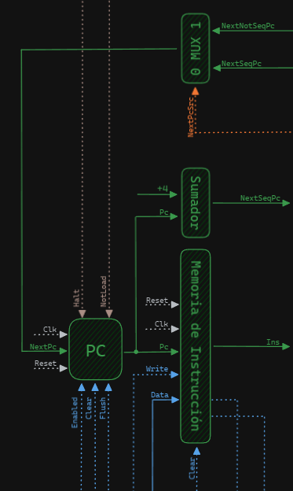
</p>

La etapa **IF** (*Instruction Fetch*) es la primera etapa del pipeline en un procesador MIPS. En esta etapa, se recupera la instrucción a ejecutar de la memoria de instrucciones. 

El módulo `_if` en el código Verilog representa esta etapa. Este módulo tiene varias entradas y salidas que permiten su interacción con otras etapas del pipeline y con la memoria de instrucciones.

Las entradas del módulo incluyen señales de control como `i_clk` (la señal de reloj), `i_reset` (para reiniciar el módulo), `i_halt` (para detener la ejecución), `i_not_load` (para indicar si se debe cargar una instrucción), `i_enable` (para habilitar el módulo), y `i_next_pc_src` (para seleccionar la fuente del próximo contador de programa o PC). También incluye entradas para la instrucción a escribir en la memoria (`i_instruction`), y los valores del próximo PC secuencial (`i_next_seq_pc`) y no secuencial (`i_next_not_seq_pc`).

Las salidas del módulo incluyen señales que indican si la memoria de instrucciones está llena (`o_full_mem`) o vacía (`o_empty_mem`), la instrucción recuperada de la memoria (`o_instruction`), y el valor del próximo PC secuencial (`o_next_seq_pc`).

Dentro del módulo, se utilizan varios componentes para realizar las operaciones necesarias. Estos incluyen un multiplexor (`mux_2_unit_pc`) para seleccionar el próximo PC, un sumador (`adder_unit`) para calcular el próximo PC secuencial, un módulo PC (`pc_unit`) para mantener y actualizar el valor del PC, y una memoria de instrucciones (`instruction_memory_unit`) para almacenar y recuperar las instrucciones a ejecutar.

#### 2. Etapa ID

<p align="center">
  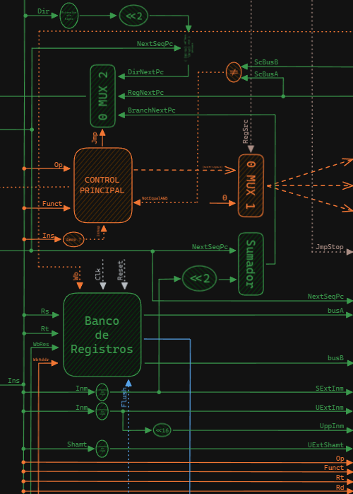
</p>

La etapa ID (Instruction Decode) es la segunda etapa del pipeline. En esta etapa, la instrucción recuperada de la memoria de instrucciones se decodifica y se leen los valores de los registros necesarios para su ejecución.

El módulo `_id` en el código Verilog representa esta etapa. Este módulo tiene varias entradas y salidas que permiten su interacción con otras etapas del pipeline y con el banco de registros.

Las entradas del módulo incluyen señales de control como `i_clk` (la señal de reloj), `i_reset` (para reiniciar el módulo), `i_flush` (para limpiar el banco de registros), `i_reg_write_enable` (para habilitar la escritura en el banco de registros), y `i_ctr_reg_src` (para seleccionar la fuente del registro de control). También incluye entradas para la instrucción a decodificar (`i_instruction`), los valores de los buses A y B de la etapa EX (`i_ex_bus_a` y `i_ex_bus_b`), y el valor del próximo PC secuencial (`i_next_seq_pc`).

Las salidas del módulo incluyen señales de control que determinan el comportamiento de las etapas posteriores del pipeline, como `o_next_pc_src`, `o_mem_rd_src`, `o_mem_wr_src`, `o_mem_write`, `o_wb`, `o_mem_to_reg`, `o_reg_dst`, `o_alu_src_a`, `o_alu_src_b`, y `o_alu_op`. También incluye salidas para los valores decodificados de varios campos de la instrucción, como `o_rs`, `o_rt`, `o_rd`, `o_funct`, `o_op`, `o_shamt_ext_unsigned`, `o_inm_ext_signed`, `o_inm_upp`, `o_inm_ext_unsigned`, y los valores de los buses A y B para la etapa EX (`o_bus_a` y `o_bus_b`).

Dentro del módulo, se utilizan varios componentes para realizar las operaciones necesarias. Estos incluyen un banco de registros para almacenar los valores de los registros, y varios multiplexores y decodificadores para decodificar la instrucción y generar las señales de control para las etapas posteriores del pipeline.

#### 3. Etapa EX

<p align="center">
  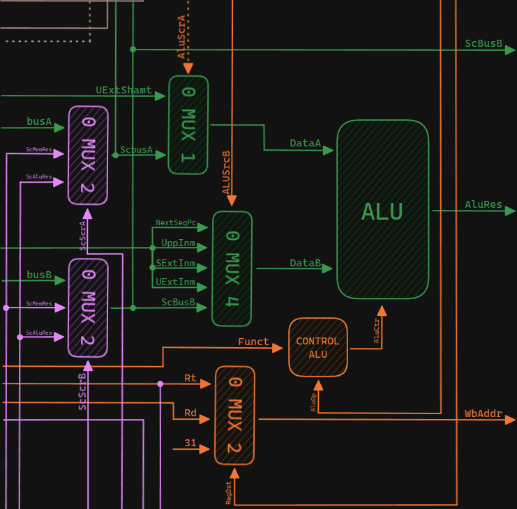
</p>

La etapa EX (Execution) es la tercera etapa del pipeline en el procesador MIPS. En esta etapa, se realizan las operaciones aritméticas y lógicas especificadas por la instrucción decodificada.

El módulo `_ex` en el código Verilog representa esta etapa. Este módulo tiene varias entradas y salidas que permiten su interacción con otras etapas del pipeline.

Las entradas del módulo incluyen señales de control como `i_alu_src_a`, `i_alu_src_b`, `i_reg_dst`, `i_alu_op`, `i_sc_src_a`, `i_sc_src_b`, `i_rt`, `i_rd`, `i_funct`, y buses de datos como `i_sc_alu_result`, `i_sc_wb_result`, `i_bus_a`, `i_bus_b`, `i_shamt_ext_unsigned`, `i_inm_ext_signed`, `i_inm_upp`, `i_inm_ext_unsigned`, `i_next_seq_pc`.

Las salidas del módulo incluyen `o_wb_addr`, `o_alu_result`, `o_sc_bus_b`, `o_sc_bus_a`.

Dentro del módulo, se utilizan varios componentes para realizar las operaciones necesarias. Estos incluyen una unidad ALU (`alu_unit`) para realizar las operaciones aritméticas y lógicas, una unidad de control ALU (`alu_control_unit`) para generar las señales de control para la ALU, y varios multiplexores (`mux_alu_src_data_a_unit`, `mux_alu_src_data_b_unit`, `mux_sc_src_a_unit`, `mux_sc_src_b_unit`, `mux_reg_dst_unit`) para seleccionar los datos de entrada para la ALU y la dirección del registro de destino para la etapa WB.

#### 4. Etapa MEM

<p align="center">
  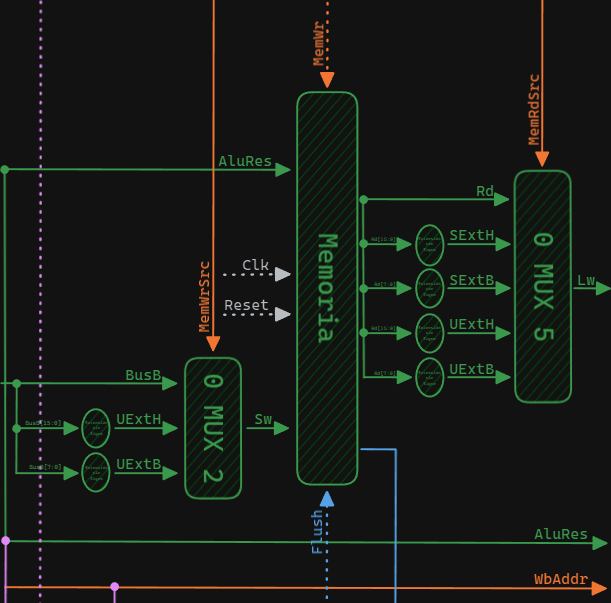
</p>

La etapa MEM (Memory) es la cuarta etapa del pipeline en el procesador MIPS. En esta etapa, si la instrucción es una operación de carga o almacenamiento, se accede a la memoria de datos.

El módulo `mem` en el código Verilog representa esta etapa. Este módulo tiene varias entradas y salidas que permiten su interacción con otras etapas del pipeline y con la memoria de datos.

Las entradas del módulo incluyen señales de control como `i_clk` (la señal de reloj), `i_reset` (para reiniciar el módulo), `i_flush` (para limpiar la memoria de datos), `i_mem_wr_rd` (para indicar si se debe realizar una operación de escritura o lectura en la memoria), `i_mem_wr_src` (para seleccionar la fuente de los datos a escribir en la memoria), `i_mem_rd_src` (para seleccionar cómo se deben leer los datos de la memoria), y `i_mem_addr` (la dirección de la memoria a la que se debe acceder). También incluye una entrada para los datos a escribir en la memoria (`i_bus_b`).

Las salidas del módulo incluyen `o_mem_rd` (los datos leídos de la memoria) y `o_bus_debug` (un bus para depuración que contiene todos los datos de la memoria).

Dentro del módulo, se utilizan varios componentes para realizar las operaciones necesarias. Estos incluyen una instancia de un módulo `data_memory` para representar la memoria de datos, varios multiplexores (`mux_in_mem_unit`, `mux_out_mem_unit`) para seleccionar los datos a escribir en la memoria y cómo se deben leer los datos de la memoria, y varias instancias de módulos `unsig_extend` y `sig_extend` para extender los datos leídos de la memoria a la longitud correcta, ya sea con extensión de signo o sin ella.

#### 5. Etapa WB

<p align="center">
  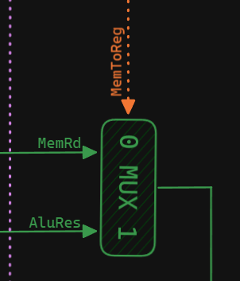
</p>

La etapa WB (Write Back) es la quinta y última etapa del pipeline en el procesador. En esta etapa, los resultados de la ejecución de la instrucción se escriben de vuelta en los registros.

El módulo `wb` en el código Verilog representa esta etapa. Este módulo tiene varias entradas y una salida que permiten su interacción con otras etapas del pipeline.

Las entradas del módulo incluyen `i_mem_to_reg` (una señal de control que indica si el resultado de la operación de memoria debe ser escrito en los registros), `i_alu_result` (el resultado de la operación de la ALU) e `i_mem_result` (el resultado de la operación de memoria).

La salida del módulo es `o_wb_data` (los datos que se deben escribir en los registros).

Dentro del módulo, se utiliza un multiplexor (`mux_wb_data`) para seleccionar entre `i_alu_result` e `i_mem_result` en función de la señal `i_mem_to_reg`. El resultado de esta selección se envía a la salida `o_wb_data`.


### Control y Detención de Riesgos
El control y la detención de riesgos en el procesador se implementan a través de los siguientes módulos:

#### Unidad de Control Principal

<p align="center">
  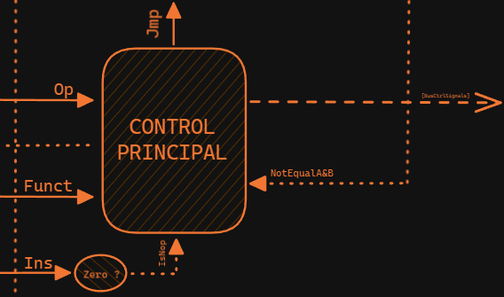
</p>

La unidad de control principal es responsable de generar las señales de control para diversas operaciones en un procesador. La unidad de control toma como entrada varios campos de la instrucción actual, como el código de operación (`i_op`), el código de función (`i_funct`), y señales adicionales como `i_bus_a_not_equal_bus_b` e `i_instruction_is_nop`. A partir de estas entradas, la unidad de control determina el valor de las señales de control que se utilizan para controlar diferentes unidades funcionales del procesador.

- `next_pc_src`: Controla la fuente del próximo valor del contador de programa (PC).
- `jmp_ctrl`: Controla el tipo de salto (si es un salto y su dirección).
- `reg_dst`: Selecciona el destino del resultado de la ALU para escribir en el registro.
- `alu_src_a` y `alu_src_b`: Seleccionan las fuentes de entrada para la ALU.
- `code_alu_op`: Especifica la operación de la ALU.
- `mem_rd_src`: Selecciona la fuente de datos de lectura de memoria.
- `mem_wr_src`: Selecciona la fuente de datos de escritura en memoria.
- `mem_write`: Controla si se realiza una operación de escritura en memoria.
- `wb`: Controla si se habilita la escritura de nuevo valor en el registro.
- `mem_to_reg`: Controla si el resultado debe escribirse en el registro desde la memoria.

todas estas señales se concentran en el bus `o_ctrl_bus` que se utiliza para controlar las diferentes unidades funcionales del procesador.

##### Tabla de Control Principal
La tabla de verdad de la unidad de control principal se muestra a continuación:


| i_op             | i_funct         | i_bus_a_not_equal_bus_b | i_instruction_is_nop | next_pc_src | jmp_ctrl | reg_dst | alu_src_a          | alu_src_b          | code_alu_op | mem_rd_src         | mem_wr_src         | mem_write | wb   | mem_to_reg         |
|------------------|-----------------|-------------------------|-----------------------|-------------|----------|---------|--------------------|--------------------|-------------|---------------------|---------------------|-----------|------|--------------------|
| `******` | `******` | `*` | `1` | `1` | `xx` | `xx` | `x` | `xxx` | `xxx` | `xxx` | `xx` | `0` | `0` | `x` |
| `CODE_OP_R_TYPE` | `CODE_FUNCT_JR` | `*` | `0` | `1` | `01` | `xx` | `x` | `xxx` | `110` | `xxx` | `xx` | `0` | `0` | `x` |
| `CODE_OP_R_TYPE` | `CODE_FUNCT_JALR` | `*` | `0` | `1` | `01` | `10` | `1` | `000` | `110` | `xxx` | `xx` | `0` | `1` | `1` |
| `CODE_OP_R_TYPE` | `CODE_FUNCT_SLL` | `*` | `0` | `1` | `xx` | `01` | `0` | `100` | `110` | `xxx` | `xx` | `0` | `1` | `1` |
| `CODE_OP_R_TYPE` | `CODE_FUNCT_SRL` | `*` | `0` | `1` | `xx` | `01` | `0` | `100` | `110` | `xxx` | `xx` | `0` | `1` | `1` |
| `CODE_OP_R_TYPE` | `CODE_FUNCT_SRA` | `*` | `0` | `1` | `xx` | `01` | `0` | `100` | `110` | `xxx` | `xx` | `0` | `1` | `1` |
| `CODE_OP_R_TYPE` | `******` | `*` | `0` | `1` | `xx` | `01` | `1` | `100` | `110` | `xxx` | `xx` | `0` | `1` | `1` |
| `CODE_OP_LW` | `******` | `*` | `0` | `1` | `xx` | `00` | `1` | `010` | `000` | `000` | `xx` | `0` | `1` | `0` |
| `CODE_OP_SW` | `******` | `*` | `0` | `1` | `xx` | `xx` | `1` | `010` | `000` | `xxx` | `00` | `1` | `0` | `x` |
| `CODE_OP_BEQ` | `******` | `1` | `0` | `1` | `xx` | `xx` | `x` | `xxx` | `001` | `xxx` | `xx` | `0` | `0` | `x` |
| `CODE_OP_BEQ` | `******` | `0` | `0` | `1` | `00` | `xx` | `x` | `xxx` | `001` | `xxx` | `xx` | `0` | `0` | `x` |
| `CODE_OP_BNE` | `******` | `1` | `0` | `1` | `00` | `xx` | `x` | `xxx` | `001` | `xxx` | `xx` | `0` | `0` | `x` |
| `CODE_OP_BNE` | `******` | `0` | `0` | `1` | `xx` | `xx` | `x` | `xxx` | `001` | `xxx` | `xx` | `0` | `0` | `x` |
| `CODE_OP_ADDI` | `******` | `*` | `0` | `1` | `xx` | `00` | `1` | `010` | `000` | `xxx` | `xx` | `0` | `1` | `1` |
| `CODE_OP_J` | `******` | `*` | `0` | `1` | `10` | `xx` | `x` | `xxx` | `111` | `xxx` | `xx` | `0` | `0` | `x` |
| `CODE_OP_JAL` | `******` | `*` | `0` | `1` | `10` | `10` | `x` | `000` | `111` | `xxx` | `xx` | `0` | `1` | `1` |
| `CODE_OP_ANDI` | `******` | `*` | `0` | `1` | `xx` | `00` | `1` | `011` | `010` | `xxx` | `xx` | `0` | `1` | `1` |
| `CODE_OP_ORI` | `******` | `*` | `0` | `1` | `xx` | `00` | `1` | `011` | `011` | `xxx` | `xx` | `0` | `1` | `1` |
| `CODE_OP_XORI` | `******` | `*` | `0` | `1` | `xx` | `00` | `1` | `011` | `100` | `xxx` | `xx` | `0` | `1` | `1` |
| `CODE_OP_SLTI` | `******` | `*` | `0` | `1` | `xx` | `00` | `1` | `010` | `101` | `xxx` | `xx` | `0` | `1` | `1` |
| `CODE_OP_LUI` | `******` | `*` | `0` | `1` | `xx` | `00` | `x` | `001` | `000` | `xxx` | `xx` | `0` | `1` | `1` |
| `CODE_OP_LBU` | `******` | `*` | `0` | `1` | `xx` | `00` | `1` | `010` | `000` | `010` | `xx` | `0` | `1` | `0` |
| `CODE_OP_LBU` | `******` | `*` | `0` | `1` | `xx` | `00` | `1` | `010` | `000` | `100` | `xx` | `0` | `1` | `0` |
| `CODE_OP_LH` | `******` | `*` | `0` | `1` | `xx` | `00` | `1` | `010` | `000` | `001` | `xx` | `0` | `1` | `0` |
| `CODE_OP_LHU` | `******` | `*` | `0` | `1` | `xx` | `00` | `1` | `010` | `000` | `011` | `xx` | `0` | `1` | `0` |
| `CODE_OP_LWU` | `******` | `*` | `0` | `1` | `xx` | `00` | `1` | `010` | `000` | `000` | `xx` | `0` | `1` | `0` |
| `CODE_OP_SB` | `******` | `*` | `0` | `1` | `xx` | `xx` | `1` | `010` | `000` | `xxx` | `10` | `1` | `0` | `x` |
| `CODE_OP_SH` | `******` | `*` | `0` | `1` | `xx` | `xx` | `1` | `010` | `000` | `xxx` | `01` | `1` | `0` | `x` |

> [!NOTE]
> Los campos marcados con '*' indican que esos bits pueden tener cualquier valor y no afectan el resultado final. Los campos marcados con 'x' indican el estado indeterminado ya que la señal no se utiliza en esa instrucción.

#### Unidad de Control ALU

<p align="center">
  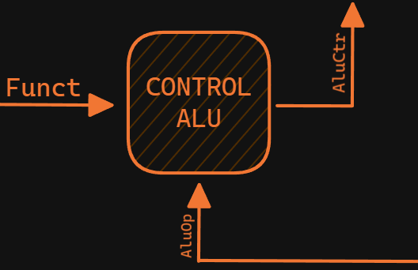
</p>

El módulo `alu_control` en el código Verilog representa la unidad de control de la ALU (Unidad Aritmética Lógica). Esta unidad genera las señales de control para la ALU en función de los códigos de operación y función de la instrucción.

Las entradas del módulo son `i_funct` (el campo funct de la instrucción, que especifica la operación a realizar en caso de instrucciones de tipo R) e `i_alu_op` (el código de operación de la ALU, que especifica la operación a realizar). Esta ultima viene de la uniadad de control principal.

La salida del módulo es `o_alu_ctr` (la señal de control para la ALU, que indica la operación que debe realizar).

##### Tabla de Control ALU
La tabla de verdad de la unidad de control de la ALU se muestra a continuación:

| i_alu_op        | i_funct          | o_alu_ctr | operación |
|-----------------|------------------|-----------|-----------|
| `CODE_ALU_CTR_R_TYPE` | `CODE_FUNCT_SLL` | `0000` | `b << a` |
| `CODE_ALU_CTR_R_TYPE` | `CODE_FUNCT_SRL` | `0001` | `b >> a` |
| `CODE_ALU_CTR_R_TYPE` | `CODE_FUNCT_SRA` | `0010` | `$signed(b) >>> a` |
| `CODE_ALU_CTR_R_TYPE` | `CODE_FUNCT_ADD` | `0011` | `$signed(a) + $signed(b)` |
| `CODE_ALU_CTR_R_TYPE` | `CODE_FUNCT_ADDU` | `0100` | `a + b` |
| `CODE_ALU_CTR_R_TYPE` | `CODE_FUNCT_SUB` | `0101` | `$signed(a) - $signed(b)` |
| `CODE_ALU_CTR_R_TYPE` | `CODE_FUNCT_SUBU` | `0110` | `a - b` |
| `CODE_ALU_CTR_R_TYPE` | `CODE_FUNCT_AND` | `0111` | `a & b` |
| `CODE_ALU_CTR_R_TYPE` | `CODE_FUNCT_OR` | `1000` | `a \| b` |
| `CODE_ALU_CTR_R_TYPE` | `CODE_FUNCT_XOR` | `1001` | `a ^ b` |
| `CODE_ALU_CTR_R_TYPE` | `CODE_FUNCT_NOR` | `1010` | `~(a \| b)` |
| `CODE_ALU_CTR_R_TYPE` | `CODE_FUNCT_SLT` | `1011` | `$signed(a) < $signed(b)` |
| `CODE_ALU_CTR_R_TYPE` | `CODE_FUNCT_SLLV` | `1100` | `a << b` |
| `CODE_ALU_CTR_R_TYPE` | `CODE_FUNCT_SRLV` | `1101` | `a >> b` |
| `CODE_ALU_CTR_R_TYPE` | `CODE_FUNCT_SRAV` | `1110` | `$signed(a) >>> b` |
| `CODE_ALU_CTR_R_TYPE` | `CODE_FUNCT_JALR` | `1111` | `b` |
| `CODE_ALU_CTR_LOAD_TYPE` | `******` | `0011` | `$signed(a) + $signed(b)` |
| `CODE_ALU_CTR_STORE_TYPE` | `******` | `0011` | `$signed(a) + $signed(b)` |
| `CODE_ALU_CTR_JUMP_TYPE` | `******` | `1111` | `b` |
| `CODE_ALU_CTR_ADDI` | `******` | `0011` | `$signed(a) + $signed(b)` |
| `CODE_ALU_CTR_ANDI` | `******` | `0111` | `a & b` |
| `CODE_ALU_CTR_ORI` | `******` | `1000` | `a \| b` |
| `CODE_ALU_CTR_XORI` | `******` | `1001` | `a ^ b` |
| `CODE_ALU_CTR_SLTI` | `******` | `1011` | `$signed(a) < $signed(b)` |

> [!NOTE]
> Los campos marcados con '*' indican que esos bits pueden tener cualquier valor y no afectan el resultado final. Los campos marcados con 'x' indican el estado indeterminado ya que la señal no se utiliza en esa instrucción.

#### Unidad de Cortocircuito

<p align="center">
  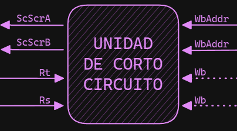
</p>

El módulo `short_circuit` en el código Verilog representa una unidad de cortocircuito. Esta unidad se utiliza para implementar el adelanto (*forwarding*) de datos, una técnica que ayuda a minimizar los riesgos de datos en el pipeline del procesador.

Las entradas del módulo son:

- `i_ex_mem_wb` y `i_mem_wb_wb`: Estas señales indican si hay datos válidos en las etapas `EX/MEM` y `MEM/WB` del pipeline, respectivamente.

- `i_id_ex_rs` y `i_id_ex_rt`: Estos son los registros fuente de la etapa `ID/EX` del pipeline.

- `i_ex_mem_addr` y `i_mem_wb_addr`: Estas son las direcciones de memoria de las etapas `EX/MEM` y `MEM/WB` del pipeline, respectivamente.

Las salidas del módulo son:

- `o_sc_data_a_src` y `o_sc_data_b_src`: Estas señales indican la fuente de los datos para los registros fuente `rs` y `rt`, respectivamente.

La lógica del módulo verifica si las direcciones de memoria de las etapas `EX/MEM` y `MEM/WB` coinciden con los registros fuente de la etapa `ID/EX`. Si es así, y si hay datos válidos en las etapas `EX/MEM` y `MEM/WB`, entonces los datos se adelantan desde estas etapas. Si no, los datos provienen de la etapa `ID/EX`.

Esto ayuda a minimizar los riesgos de datos al permitir que las instrucciones utilicen los resultados de las instrucciones anteriores tan pronto como estén disponibles, en lugar de esperar a que las instrucciones anteriores se completen y los resultados se escriban en los registros.

##### Tabla de Control Cortocircuito
La tabla de verdad de la unidad de cortocircuito se muestra a continuación:

| i_ex_mem_wb | i_mem_wb_wb | i_ex_mem_addr == i_id_ex_rs | i_mem_wb_addr == i_id_ex_rs | o_sc_data_a_src |
|-------------|-------------|-----------------------------|-----------------------------|-----------------|
| `1`           | `-`           | `1`                           | `-`                           | `EX_MEM`          |
| `0 or -`      | `1`           | `-`                           | `1`                           | `MEM_WB`          |
| `0 or -`      | `0 or -`      | `0 or -`                      | `0 or -`                      | `ID_EX`          |

| i_ex_mem_wb | i_mem_wb_wb | i_ex_mem_addr == i_id_ex_rt | i_mem_wb_addr == i_id_ex_rt | o_sc_data_b_src |
|-------------|-------------|-----------------------------|-----------------------------|-----------------|
| `1`           | `-`           | `1`                           | `-`                           | `EX_MEM`         |
| `0 or -`      | `1`           | `-`                           | `1`                           | `MEM_WB`          |
| `0 or -`      | `0 or -`      | `0 or -`                      | `0 or -`                      | `ID_EX`           |

> [!NOTE]
> En esta tabla, `EX_MEM`, `MEM_WB` e `ID_EX` representan las etapas del pipeline de donde se obtienen los datos. `i_ex_mem_addr == i_id_ex_rs` y `i_ex_mem_addr == i_id_ex_rt` representan comparaciones de igualdad entre las direcciones de memoria y los registros fuente. Si la comparación es verdadera, significa que los datos para el registro fuente correspondiente se pueden obtener de la etapa `EX_MEM`. De manera similar, `i_mem_wb_addr == i_id_ex_rs` y `i_mem_wb_addr == i_id_ex_rt` representan comparaciones de igualdad para la etapa `MEM_WB`.

#### Unidad de Detención de Riesgos

<p align="center">
  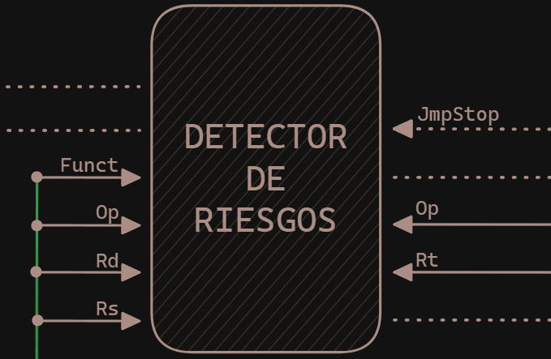
</p>

El módulo `risk_detection` en el código Verilog representa una unidad de detección de riesgos. Esta unidad se utiliza para detectar y manejar situaciones que podrían causar problemas en el pipeline del procesador, como los riesgos de datos y control.

Las entradas del módulo son:

- `i_jmp_stop`, `i_if_id_rs`, `i_if_id_rd`, `i_if_id_op`, `i_if_id_funct`, `i_id_ex_rt`, `i_id_ex_op`: Estas señales representan varias partes de las instrucciones en las etapas `IF/ID` y `ID/EX` del pipeline, incluyendo los códigos de operación y función, los registros fuente y destino, y una señal que indica si se debe detener el salto.

Las salidas del módulo son:

- `o_jmp_stop`: Esta señal se activa si se debe detener el procesador un ciclo debido a un salto, lo cual ocurre si la instrucción en la etapa `IF/ID` es un salto y la señal `i_jmp_stop` no está activa.
- `o_halt`: Esta señal se activa si la instrucción en la etapa `IF/ID` es una instrucción de finalización de programa.
- `o_not_load`: Esta señal se activa si la instrucción en la etapa `ID/EX` es una instrucción de carga y el registro destino coincide con uno de los registros fuente de la instrucción en la etapa `IF/ID`, o si la señal `o_jmp_stop` está activa. Esto indica un riesgo de datos.
- `o_ctr_reg_src`: Esta señal es igual a la señal `o_not_load` y se utiliza para indicar si las señales de control se propagan a las siguientes etapas o no.

La lógica del módulo verifica las instrucciones en las etapas `IF/ID` y `ID/EX` del *pipeline* y activa las señales de salida correspondientes si detecta un riesgo o si se da una instrucción de salto que haga uso de los registros del procesador (potencial riesgo).

##### Tabla de Control Detención de Riesgos

La tabla de verdad para la unidad de detección de riesgos se basa en las señales de entrada y determina las señales de salida. Aquí está la tabla de verdad simplificada:

| i_jmp_stop | i_if_id_funct == `CODE_FUNCT_JALR` or `CODE_FUNCT_JR` | i_if_id_op == `CODE_OP_R_TYPE` | i_if_id_op == `CODE_OP_BNE` or `CODE_OP_BEQ` | o_jmp_stop |
|------------|------------------------------------------------------|--------------------------------|---------------------------------------------|------------|
| `0`          | `1`                                                    | `1`                              | `-`                                           | `1`          |
| `0`          | `-`                                                    | `-`                              | `1`                                           | `1`          |
| `1 or -`     | `-`                                                    | `-`                              | `-`                                           | `0`          |

| i_if_id_op == `CODE_OP_HALT` | o_halt |
|-----------------------------|--------|
| `1`                           | `1`      |
| `0`                           | `0`      |

| i_id_ex_rt == i_if_id_rs or i_if_id_rd | i_id_ex_op == `CODE_OP_LW` or `CODE_OP_LB` or `CODE_OP_LBU` or `CODE_OP_LH` or `CODE_OP_LHU` or `CODE_OP_LUI` or `CODE_OP_LWU` | o_jmp_stop | o_not_load |
|----------------------------------------|------------------------------------------------------------------------------------------------------------------|------------|------------|
| `1`                                      | `1`                                                                                                                  | `-`          | `1`          |
| `-`                                      | `-`                                                                                                                  | `1`          | `1`          |
### Operación del Procesador
Para operar el procesador, se debe cargar un programa en la memoria de instrucciones. Luego, se debe iniciar el procesador y ejecutar el programa. El procesador se detendrá automáticamente cuando se ejecute la instrucción `halt`. Para que esto sea posible se implementó un módulo `uart` que permite la comunicación con el procesador a través de una terminal serial y un módulo `debugger` que controla la comunicación entre el procesador y el módulo `uart`.

#### UART

<p align="center">
  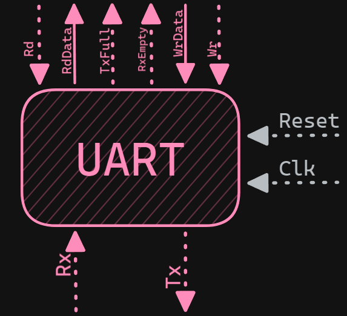
</p>

Este módulo Verilog define una [UART (Universal Asynchronous Receiver-Transmitter)](https://es.wikipedia.org/wiki/Universal_Asynchronous_Receiver-Transmitter), que es un dispositivo que se utiliza para la comunicación serial asíncrona entre dispositivos digitales.

El módulo `uart` tiene varios parámetros configurables, incluyendo el número de bits de datos (`DATA_BITS`), el número de ticks para el bit de inicio (`SB_TICKS`), el bit de precisión de la tasa de baudios (`DVSR_BIT`), el divisor de la tasa de baudios (`DVSR`) y el tamaño de la FIFO (`FIFO_SIZE`).

Las entradas del módulo incluyen la señal de reloj (`clk`), la señal de reset (`reset`), las señales de lectura y escritura de la UART (`rd_uart` y `wr_uart`), la señal de recepción (`rx`) y los datos a escribir (`w_data`).

Las salidas del módulo incluyen las señales de llenado completo y vacío de la transmisión y recepción (`tx_full` y `rx_empty`), la señal de transmisión (`tx`) y los datos leídos (`r_data`).

El módulo `uart` consta de varias subunidades:

- `uart_brg`: Genera la señal de tick para la tasa de baudios.
- `uart_rx`: Maneja la recepción de datos.
- `uart_tx`: Maneja la transmisión de datos.
- `fifo_rx_unit` y `fifo_tx_unit`: Son colas FIFO para almacenar los datos recibidos y a transmitir, respectivamente.

Cada subunidad tiene su propia configuración y señales de entrada y salida, que se conectan a las entradas y salidas del módulo `uart` para formar un sistema de comunicación UART completo.

#### Debugger

<p align="center">
  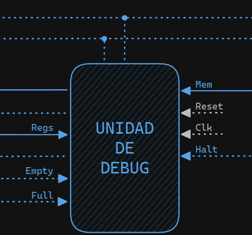
</p>

El módulo `debugger` se utiliza para depurar y controlar la ejecución de un procesador MIPS mediante la interfaz UART. Permite la carga de programas en la memoria de instrucciones del procesador, la ejecución paso a paso, la visualización de registros y datos en memoria, así como la comunicación con un entorno de desarrollo a través de la interfaz UART. 

Las salida del módulo incluyen:

- **o_uart_wr:** Señal de escritura para la interfaz UART.
- **o_uart_rd:** Señal de lectura para la interfaz UART.
- **o_mips_instruction:** Instrucción actual ejecutada por el procesador.
- **o_mips_instruction_wr:** Indica si hay una instrucción a escribir en la memoria de instrucciones.
- **o_mips_flush:** Señal para realizar un flush en el procesador.
- **o_mips_clear_program:** Señal para limpiar el programa en el procesador.
- **o_mips_enabled:** Indica si el procesador está habilitado para la ejecución.
- **o_uart_data_wr:** Datos a escribir en la interfaz UART.
- **o_status_flags:** Diversas señales de estado, incluyendo el estado de la memoria y la ejecución.

Sus funciones principales son:

1. **Control de Estados:**
   - El módulo tiene un conjunto de estados que determinan su comportamiento en función de las señales de entrada y salida.

2. **Carga de Programa:**
   - En el estado inicial (`DEBUGGER_STATE_IDLE`), el debugger espera comandos a través de la interfaz UART.
   - Puede cargar programas en la memoria de instrucciones del procesador (`DEBUGGER_STATE_LOAD`).
   - Detecta comandos como "L" para cargar un programa.

3. **Ejecución del Programa:**
   - Puede iniciar la ejecución del programa en el procesador (`DEBUGGER_STATE_RUN`).
   - Permite la ejecución paso a paso mediante comandos ("S" para un paso, "E" para ejecución continua).

4. **Visualización de Registros y Memoria:**
   - Muestra el contenido de los registros y la memoria en el estado `DEBUGGER_STATE_PRINT_REGISTERS` y `DEBUGGER_STATE_PRINT_MEMORY_DATA` respectivamente.
   - La información se envía a través de la interfaz UART para su visualización en un entorno de desarrollo.

5. **Comunicación UART:**
   - Permite la lectura y escritura de datos a través de la interfaz UART.
   - Gestiona buffers de lectura y escritura para la comunicación UART.

6. **Control de Flujo:**
   - Controla el flujo de ejecución del programa MIPS en función de los comandos recibidos y las condiciones del programa.

### Clock Wizard
El [*Clock Wizard*](https://www.xilinx.com/products/intellectual-property/clocking_wizard.html) es una herramienta que se utiliza para generar la señal de reloj del sistema. En este proyecto, el *Clock Wizard* se utiliza para generar una señal de reloj con una frecuencia específica que sincroniza todas las operaciones del sistema.

En un sistema MIPS, el reloj del sistema es fundamental para controlar el flujo de instrucciones y datos a través del procesador. Cada tick del reloj representa un ciclo de instrucción, durante el cual el procesador puede, por ejemplo, leer una instrucción de la memoria, decodificarla, ejecutarla y escribir los resultados de vuelta en la memoria.

Además, en un sistema más complejo, el "Clock Wizard" puede generar múltiples señales de reloj con diferentes frecuencias a partir de una única señal de reloj de entrada. Esto puede ser útil en un sistema MIPS si diferentes componentes del sistema necesitan operar a diferentes velocidades. No es el caso de este proyecto.

## Simulaciones

## Resultados

## Referencias

- Patterson, D. A., & Hennessy, J. L. (2013). Computer Organization and Design MIPS Edition: The Hardware/Software Interface. Morgan Kaufmann.

- Hennessy, J. L., & Patterson, D. A. (2011). Computer Architecture: A Quantitative Approach. Morgan Kaufmann.

- Kane, G., & Heinrich, J. (1992). MIPS RISC Architecture. Prentice Hall.

- Sweetman, D. (2007). See MIPS Run. Morgan Kaufmann.